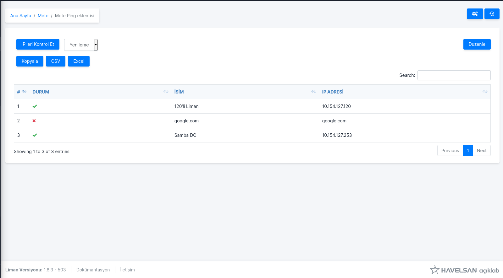
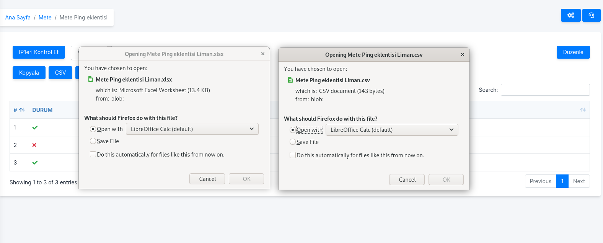
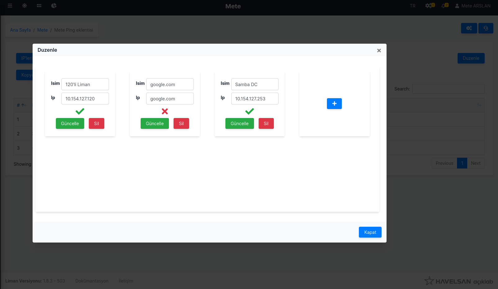
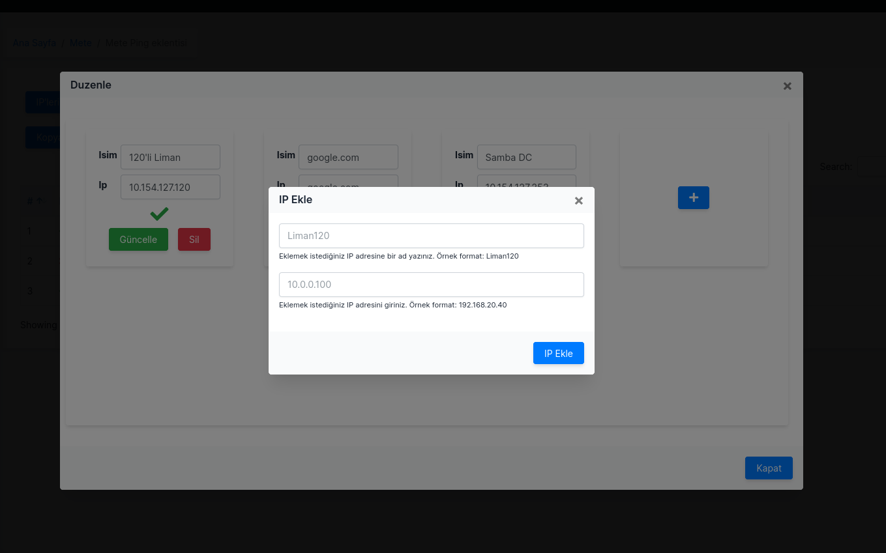

<!-- PROJECT LOGO -->
 

  <h1 align="center">Liman Ping Eklentisi</h3>

  

    Verilen IP ve Domain Adreslerinin Ulaşılıp Ulaşılmadığını Kontrol Eden Eklenti
  

<!-- TABLE OF CONTENTS -->

  
İçerik

  <ul style="list-style:square">
    <li><a href="#proje-hakkında">Proje Hakkında</a></li>
    <li><a href="#kurulum">Kurulum</a></li>
    <li>
        <a href="#kullanım">Kullanım</a>
        <ul>
            <li><a href="#ana-sayfa">Ana Sayfa</a></li>
            <li><a href="#tabloyu-indirmek">Tabloyu İndirmek</a></li>
            <li><a href="#tabloyu-düzenlemek">Tabloyu Düzenlemek</a></li>
            <li><a href="#ip-eklemek">IP Eklemek</a></li>
        </ul>
    </li>
    <li><a href="#katkı-sağlayanlar">Katkı Sağlayanlar</a></li>
    <li><a href="#iletişim">İletişim</a></li>
  </ul>

 

## Proje Hakkında

Verilen IP ve Domain adreslerinin ulaşılıp ulaşılmadığını kontrol eder. IP'ler bir isim verilerek kaydedilebilir. Ulaşılma durumu **"Excel"**, **"CSV"** ya da **düz yazı** olarak alınabilinir. Ulaşılma kontrol aralığını değiştirebilirsiniz.

## Kurulum

Size verilen Ping-0.0.1.lmne dosyasını Liman üzerinden eklentiler kısmına ekleyin. Eklentiyi kullanmak istediğiniz sunucunun detaylar sayfasında eklentiler kısmına ekleyin.(Not: Eklenti yalnızca kurmuş olduğunuz serverın verdiğiniz adreslere ulaşıp ulaşmadığını kontrol eder)

## Kullanım

### Ana Sayfa

Eklentiye girdiğinizde ana sayfada yukarıdaki sayfaya benzer bir sayfa göreceksiniz. Bu sayfa **"IP'leri Kontrol Et"** butonu IP'leri bastığınız an için kontrol eder. Butonun yanında bulunan Combobox ile otomatik yenilenme aralığını seçilir. Düzenle butonu ile düzenleme ekranı açılacaktır.

### Tabloyu İndirmek

Ana sayfada bulunan **"Kopyala"** butonu ile tabloyu doğrudan kopyalanabilir. **"CSV"** ve **"Excel"** butonları ile tabloyu verilen formatlarda indirilir. Tablo içerisinde arama yapmak için **"Search"** yazan Textbox ile arama yapılabilir.

### Tabloyu Düzenlemek

Ana sayfada bulunan düzenle butonuna basıldıktan sonra yukarıda bulunan ekran açılacaktır. Önceden eklemiş olduğunuz IP'leri ya da isimlerini değiştirdikten sonra **"Güncelle"** butonu ile yağtığınız değişiklikler kaydedilir. **"Sil"** butonu kaydedilmiş olan IP'yi siler.

### IP Eklemek

**"+"** butonuna basığınızda yukarıda görülen ekran açılacaktır. Bu ekranda IP ve isim bilgilerini doldurduktan sonra **"IP Ekle"** ile IP kaydedilir. İşlem bittikten sonra modalı kapatmak için yukıda bulunan **"x"** butonuna basılır.

## Katkı Sağlayanlar
@White-Hare(Mete ARSLAN)

## İletişim
stj.marslan@havelsan.com.tr

https://www.linkedin.com/mwlite/in/metearslan

(<a href="#top">başa dön</a>)

